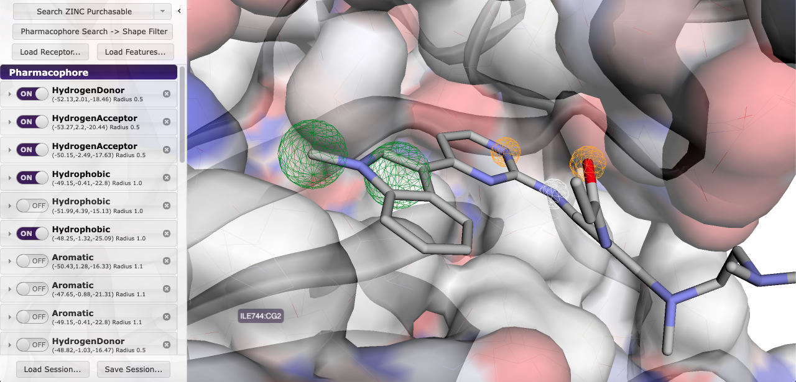
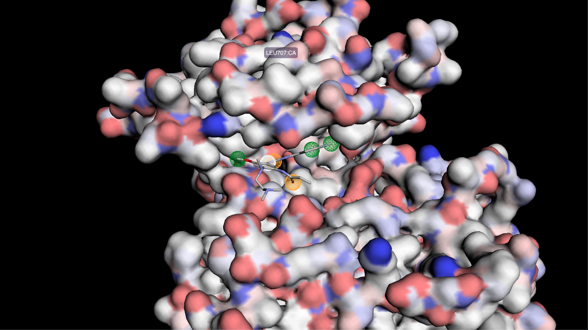

# An introduction to Computer Aided Drug Design

### Introduction
Computer aided drug design (CADD) is widely used in the pharmaceutical industry as a method of identifying potential novel drug molecules by performing virtual screening of compound libraries containing millions of drug-like molecules.

 CADD techniques can be classified as 

 1. **Structure Based Drug Design**
 2. **Ligand Based Drug Design**

 Structure based Drug Design requires _knowing the structure of the target macromolecule_ (protein, receptor, enzyme, nucleic acid) whereas the ligand based drug design is used when _there is no 3D macromolecule structure available_ and relies on knowledge of compounds that bind to the target site on the macromolecule.

### Purpose of the project
This project was created during my undergraduate dissertation required to attain a Bachelor of Pharmacy degree at the Kenyatta University. It involves the use of structure based pharmacophore modeling, virtual screening and simulated molecular docking performed by AutoDock Vina. The main aim of this project was to find potential Epidermal Growth Factor Receptor (EGFR) inhibitor candidates that may be used as lead compounds in drug development and synthesis.

### Background

<figure>

<figcaption>
Osimertinib binding to the tyrosine kinase domain of EGFR
</figcaption>
</figure>

Epidermal Growth Factor Receptors (EGFR) are one of the most significant targets in cancer pathology. They are necessary for proliferation on various cancers such as Non-Small Cell Lung Cancer (NSCLC), Colorectal cancer, Pancreatic cancer e.t.c. Aberrant mutations in EGFR lead to auto activation of the receptor. This sends continuous signals to cells instructing them to keep growing which uncontrolled proliferation and eventually metastasis.

EGFR can be inhibited by small molecule drugs called Tyrosine Kinase Inhibitors (TKI). They tend to possess the -nib suffix in their name. Common TKIs in use include Imatinib, Gefitinib, Osimertinib e.t.c. A major problem with existing tyrosine kinase inhibitors is the emergence of resistance caused by mutations in DNA that code for EGFR. The major mutations that confer resistance are T790M (Tyrosine substitued for Methionine at codon 790), L858R (Arginine substitued for Leucine at codon 858) and Exon 19 deletion. 

By using Computer Aided Drug Design we can try and identify new molecules that bind to the tyrosine kinase domain of the EGFR. To find out more about how these receptors work, [checkout this wiki page on EGFR](https://en.wikipedia.org/wiki/Epidermal_growth_factor_receptor). As for tyrosine kinase inhibitors, read more [here](https://en.wikipedia.org/wiki/Tyrosine_kinase_inhibitor).
